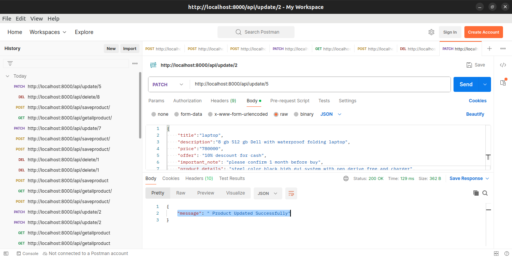

<p align="center"><a href="https://laravel.com" target="_blank"></a></p>

## AJAX CURD SHOPPING PRODUCT AND LOGIN LOGOUT FUNCTIONALTY WITH POSTMAN TESTING TOOL
 I AM USING LINUX UBANTU 22.4 

## Install Laravel
 - install composer 
 - install xampp server 
 - for install (laravel)
 ```
-  composer global require laravel/installer.
 - laravel new example-app
 ```
 when install all the dependencies.

## setup your database 
 - .env files 

## Run your project 
```
php artisan serve 

```
### you can import database 
- there is mysql folder in my sql folder demo.sql 
- you can import the database 

## setup controller files
- make controller 
- make model 
- create a route in api 

```
create controller and table and model command 
- php artisan make:controller controller_name
- php artisan make:model model_name
- php artisan migaration:create_table_name_table
```
## IN CONTROLLER FILES(ShoppingController)
app>http>controller>shoppingcontroller
```
<?php

namespace App\Http\Controllers;

use App\Models\addproduct;
use Illuminate\Http\Request;
use Illuminate\Support\Facades\Redirect;

class ShoppingController extends Controller
{

    // all product
    public function GetAllProduct()
    {
        $product = addproduct::all();
        return response()->json($product);
    }

    // create and store prodcut
    public function Storeproduct(Request $req)
    {
        $product = new addproduct;
        $product->title = $req->title;
        $product->description = $req->description;
        $product->price = $req->price;
        $product->offer = $req->offer;
        $product->important_note = $req->important_note;
        $product->product_details = $req->product_details;
        $product->file = $req->file;
        $product->save();

        $res=[
          "message"=>"Product Created Successfully"
        ];
        return response()->json($res);
    }

    // delete product
    public function DeleteProduct($id)
    {
        $product = addproduct::find($id);
        $product->delete();
        $res = [
            'message' => 'Product deleted successfully'
        ];
        return response()->json($res);
    }

    // update product
    public function update(Request $req, $id)
    {
        $product = addproduct::find($id);
        $product->title = $req->title;
        $product->description = $req->description;
        $product->price = $req->price;
        $product->offer = $req->offer;
        $product->important_note = $req->important_note;
        $product->product_details = $req->product_details;
        $product->file = $req->file;
        $product->update();
        $res = [
            "message" => " Product Updated Successfully"
        ];
        return response()->json($res);
    }
}

```

## IN MIGRATION FILES (ADDPRODUCTS)
database>migrations>addproducts
```
<?php

use Illuminate\Database\Migrations\Migration;
use Illuminate\Database\Schema\Blueprint;
use Illuminate\Support\Facades\Schema;

return new class extends Migration
{
    /**
     * Run the migrations.
     */
    public function up(): void
    {
        Schema::create('addproducts', function (Blueprint $table) {
            $table->id();
            $table->string('title');
            $table->string('description');
            $table->string('price');
            $table->string('offer');
            $table->string('important_note');
            $table->string('product_details');
            $table->string('file');
            $table->timestamps();
        });
    }

    /**
     * Reverse the migrations.
     */
    public function down(): void
    {
        Schema::dropIfExists('addproducts');
    }
};

```

## IN MODEL FILES(ADDPRODUCT)
app>models>addproduct

 ```
 <?php

namespace App\Models;

use Illuminate\Database\Eloquent\Factories\HasFactory;
use Illuminate\Database\Eloquent\Model;

class addproduct extends Model
{
    use HasFactory;

    protected $fillable=[
        'title',
        'description',
        'price',
        'offer',
        'important_note',
        'product_details',
        'file',
    ];
}

 ```
## IN ROUTING FILES(API.PHP)
routes>api.php

```
<?php

use Illuminate\Http\Request;
use Illuminate\Support\Facades\Route;
use App\Http\Controllers\ShoppingController;


Route::get('/getallproduct',[ShoppingController::class,"GetAllProduct"]);
Route::post("/saveproduct",[ShoppingController::class,"Storeproduct"])->name("saveproduct");
// set Route for delete
// browser =get
// postman=delete
Route::delete("/delete/{id}",[ShoppingController::class,"DeleteProduct"]);
Route::patch("update/{id}",[ShoppingController::class,"update"]);

 
```
## SAVE PRODUCT VIA API POSTMAN


## GET ALL PRODUCT VIA API POSTMAN


## DELETE PRODUCT WITH ID IN POSTMAN


## UPDATE PRODUCT WITH ID IN POSTMAN


 ## License


The Laravel framework is open-sourced software licensed under the [MIT license](https://opensource.org/licenses/MIT).
